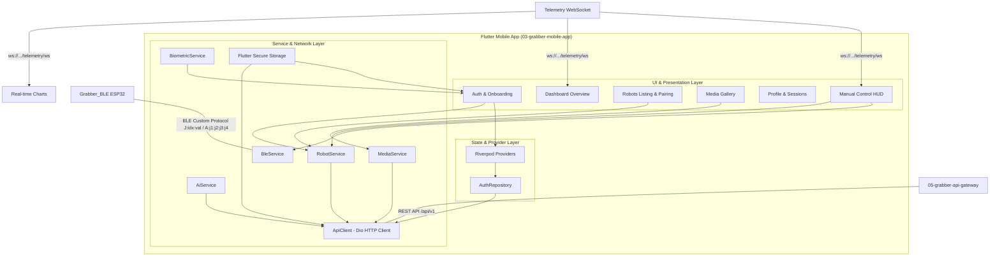

# 📱 Grabber Mobile Application

> **Repository `03`** · Premium Flutter-based cross-platform mobile client for local BLE teleoperation, real-time WebSocket monitoring, and cloud-based AI automation of the Grabber 4DOF robotic arm.

[]()
[]()
[]()
[]()
[]()
[]()
[]()

---

## 🎥 Video Demonstration

<div align="center">
  <a href="https://youtu.be/KqTVIFWJg_0?si=eDpvTGZIX7N_1OPA">
    
  </a>
  <br/>
  <sub>Click the image above to watch the demonstration video on YouTube.</sub>
</div>

---

## 🧭 System Architecture

The mobile application acts as the control center of the Grabber system. It utilizes a **dual-mode communication layer** that permits direct peer-to-peer control over local Bluetooth (BLE) for zero-latency operations, alongside cloud-based remote control and telemetry monitoring through the system API gateway.



### Core Communication Pipelines
1. **Local Teleoperation Pipeline (Low Latency)**: Virtual touch joysticks invoke the direct BLE send methods at 20Hz, converting inputs to ASCII strings (`A:j1:j2:j3:j4\n`) and flashing them directly to the ESP32 control board via the Bluetooth RF channel.
2. **Cloud Control Pipeline**: Toggling connection mode redirects joystick outputs to the REST client service throttled at 150ms, writing values to the API Gateway using HTTP POST endpoints.
3. **Telemetry & Live Data Pipeline**: Opens a persistent WebSocket connection at startup to ingest battery levels, voltage charts, and 4-axis telemetry limits.

---

## 📂 Project Structure

Unlike standard simple setups, this application is engineered following clean architecture principles using a **feature-based folder structure**:

```
lib/
├── core/
│   ├── network/            # ApiClient configuration using Dio (interceptors, headers)
│   ├── services/           # Platform channels (Biometric authentication)
│   └── theme/              # Custom UI light & dark styling tokens
├── widgets/                # Shared custom design widgets (Glassmorphic cards, Shimmers, etc.)
└── features/               # Feature-based system modules
    ├── auth/               # Onboarding flow, Welcome screens, Login, Signup, OTP, and Auth state
    ├── control/            # Virtual joysticks, sliders, AI voice controls, and BLE service
    ├── dashboard/          # Shell routing, overview cards, notifications, and real-time telemetry
    ├── media/              # Live stream player, captured image/video gallery, and deletion actions
    ├── robots/             # Adding, updating, and unpairing physical/cloud robots
    └── profile/            # Profile settings, password modifications, and session managers
```

### Module Code Index

Below is a detailed list of core files within this repository, providing quick access to specific implementations:

* **Entrypoint & Navigation**:
  * [lib/main.dart](lib/main.dart): The root application launcher. Handles system-level startup configurations, permission request routines for Android/iOS, and maps the complete GoRouter navigation hierarchy via `goRouterProvider` (supporting shell routing and landscape locking constraints on control screens).
  * [lib/features/dashboard/screens/main_shell.dart](lib/features/dashboard/screens/main_shell.dart): Container screen that encapsulates GoRouter's child routes within a navigation shell, showing a premium bottom navigation bar managed with Lucide icons.

* **Core Utility Layer**:
  * [lib/core/network/api_client.dart](lib/core/network/api_client.dart): Houses `ApiClient`. Configured with connection/receive timeouts, default headers, and a request interceptor that reads authentication tokens from secure storage to dynamically inject `Authorization: Bearer <token>` on all outbound REST requests.
  * [lib/core/services/biometric_service.dart](lib/core/services/biometric_service.dart): Implements the static class `BiometricService` wrapping `local_auth`. Exposes helper utilities for device capability discovery (`isBiometricSupported`), enrollment status checking (`hasEnrolledBiometrics`), and localized biometric prompt verification (`authenticate`).
  * [lib/core/theme/app_theme.dart](lib/core/theme/app_theme.dart): Contains `AppTheme` declaring light and dark UI configurations. Uses Google Fonts `Plus Jakarta Sans` as the primary typography, and binds unified custom text, button, card, and input styles.

* **Premium UI Widgets**:
  * [lib/widgets/premium_widgets.dart](lib/widgets/premium_widgets.dart): Houses premium custom UI assets:
    * `HeaderWavePainter`: Custom painter rendering the fluid organic gradient waves.
    * `SlideFade`: Animation widget driving smooth entrance transitions.
    * `BouncingCard`: Touch-feedback component scaling down on tap.
    * `EssentialStatusCard`: Structured display box showing system parameters.
  * [lib/widgets/glass_card.dart](lib/widgets/glass_card.dart): Premium container applying a frosted glassmorphism effect using `BackdropFilter` overlays.
  * [lib/widgets/shimmer_skeleton.dart](lib/widgets/shimmer_skeleton.dart): Animated skeleton loader used for mock indicators.
  * [lib/widgets/pattern_background.dart](lib/widgets/pattern_background.dart): Draws high-fidelity grid geometries.
  * [lib/widgets/status_card.dart](lib/widgets/status_card.dart): Component indicating robot states with visual status dots.
  * [lib/widgets/custom_text_field.dart](lib/widgets/custom_text_field.dart) & [lib/widgets/custom_button.dart](lib/widgets/custom_button.dart): UI input text fields and customized interactive buttons.

* **Authentication & Identity feature**:
  * [lib/features/auth/providers/auth_provider.dart](lib/features/auth/providers/auth_provider.dart): Orchestrates app auth state with `AuthNotifier`, handling user token lifecycle, secure credential caching, and biometric verification routines.
  * [lib/features/auth/providers/auth_repository.dart](lib/features/auth/providers/auth_repository.dart): Maps REST endpoints on the authorization service for registrations, login checks, OTP verification, and password recovery.
  * [lib/features/auth/screens/welcome_screen.dart](lib/features/auth/screens/welcome_screen.dart), [lib/features/auth/screens/login_screen.dart](lib/features/auth/screens/login_screen.dart), [lib/features/auth/screens/register_screen.dart](lib/features/auth/screens/register_screen.dart), [lib/features/auth/screens/otp_screen.dart](lib/features/auth/screens/otp_screen.dart), [lib/features/auth/screens/forgot_password_screen.dart](lib/features/auth/screens/forgot_password_screen.dart), [lib/features/auth/screens/onboarding_screen.dart](lib/features/auth/screens/onboarding_screen.dart): Screens managing login/signup wizard paths, OTP confirmation screens, and introductory sliders.

* **Robotics Controls feature**:
  * [lib/features/control/screens/manual_control_screen.dart](lib/features/control/screens/manual_control_screen.dart): Main manual control view. Locks device screen orientation to landscape, presents virtual joysticks processed in a `Timer.periodic` loop at 20Hz, offers live feedback on current joints, and triggers remote emergency stop commands.
  * [lib/features/control/screens/ai_control_screen.dart](lib/features/control/screens/ai_control_screen.dart): Connects with autonomous sorting pipelines, displays execution states, and supports adding custom operator facial signatures through a camera snapshot dialog.
  * [lib/features/control/services/ble_service.dart](lib/features/control/services/ble_service.dart): Singleton wrapper around `flutter_blue_plus`. Manages discovery of `Grabber_BLE`, MTU negotiation, service scanning, and characteristic writing commands.
  * [lib/features/control/services/ai_service.dart](lib/features/control/services/ai_service.dart): Service managing AI microservice tasks (start, stop, and registration of biometric faces via multipart request).

* **Dashboard & Metrics feature**:
  * [lib/features/dashboard/screens/dashboard_screen.dart](lib/features/dashboard/screens/dashboard_screen.dart): App landing screen summarizing paired arms, notifications list, and direct links to active modules.
  * [lib/features/dashboard/screens/telemetry_screen.dart](lib/features/dashboard/screens/telemetry_screen.dart): Listens to live WebSocket updates from the gateway telemetry server. Graphs power logs (mW) on a LineChart and displays joint angle progress indicators.
  * [lib/features/dashboard/screens/notification_details_screen.dart](lib/features/dashboard/screens/notification_details_screen.dart): Details viewer layout for recent system alarms.

* **Robots paired directory**:
  * [lib/features/robots/screens/robots_screen.dart](lib/features/robots/screens/robots_screen.dart): Standard screen displaying paired devices. Includes a tab layout containing cloud-registered robots and a local Bluetooth scanner.
  * [lib/features/robots/services/robot_service.dart](lib/features/robots/services/robot_service.dart): Implements `RobotService` matching cloud endpoints to pair robots, unpair robots, alter nick settings, and send REST kinematics/homing instructions.

* **Media Gallery feature**:
  * [lib/features/media/screens/media_screen.dart](lib/features/media/screens/media_screen.dart): Grid displaying historical screenshots and video files stored on telemetry buckets.
  * [lib/features/media/services/media_service.dart](lib/features/media/services/media_service.dart): Queries telemetry files and triggers delete commands on specific assets.

* **Profile & Session Management**:
  * [lib/features/profile/screens/profile_screen.dart](lib/features/profile/screens/profile_screen.dart): Summary of active operator parameters, profile photo, security configurations, and logout actions.
  * [lib/features/profile/screens/edit_profile_screen.dart](lib/features/profile/screens/edit_profile_screen.dart): Interface to update name details, phone numbers, and profile photos.
  * [lib/features/profile/screens/change_password_screen.dart](lib/features/profile/screens/change_password_screen.dart): Change password verification form.
  * [lib/features/profile/screens/sessions_screen.dart](lib/features/profile/screens/sessions_screen.dart): Connects with session listings on the auth server. Allows the user to view all active logins and revoke specific tokens.
  * [lib/features/profile/services/profile_service.dart](lib/features/profile/services/profile_service.dart): API communication class for profile data, password changes, profile photo uploads, and session lists.

---

## ⚡ Dual-Mode Communication Protocol

The Grabber Mobile App implements two separate channels to command the robotic arm:

### 1. Direct Peer-to-Peer Bluetooth (BLE)

Designed for zero-latency local operations (e.g. testing calibration, initial set up), bypassing all remote API nodes.

#### Device Connection Setup
* **Device Advertised Name Filter**: Matches exactly `Grabber_BLE`
* **Target Service UUID**: `4fafc201-1fb5-459e-8fcc-c5c9c331914b`
* **Target Control Characteristic UUID**: `beb5483e-36e1-4688-b7f5-ea07361b26a8`

#### MTU Negotiation & Platform Adjustments
When establishing a connection, Android devices require MTU adjustments to avoid command string truncation (default MTU of 23 limits packets). The `BleService` requests an expanded MTU of 256 bytes for single-packet writes:
```dart
try {
  if (Platform.isAndroid) {
    await _device!.requestMtu(256);
  }
} catch (_) {}
```

#### Write Configurations & Custom Frame Schema
Writes are executed in `withoutResponse` mode (write commands are sent directly without waiting for a confirmation packet) to optimize loop updates.

* **Single Joint Command Format**: `J:<servo_index>:<angle_float>\n`
  * *Example*: `J:0:90.0\n` (sets servo 0 to exactly 90.0 degrees).
* **Simultaneous Multi-Axis Format**: `A:<j1_int>:<j2_int>:<j3_int>:<j4_int>\n`
  * *Example*: `A:90:100:60:90\n` (dispatches target coordinates to all 4 axes simultaneously using integer fields to conserve packet space).

### 2. Cloud API Gateway Interface (REST & WebSockets)

Designed for remote, long-distance operation over TCP networks.

#### Teleoperation Joystick Throttling
To prevent overloading the Express gateway and MySQL logging services during joystick drags, the manual control page throttles REST requests. Joint writes are restricted to a maximum rate of one message every 150ms using a timestamp tracker:
```dart
final now = DateTime.now();
if (_lastInternetSendTime == null || now.difference(_lastInternetSendTime!) >= const Duration(milliseconds: 150)) {
  _lastInternetSendTime = now;
  // Send REST Commands to Gateway
}
```

#### Telemetry WebSocket
The `TelemetryScreen` sets up a persistent socket path using `web_socket_channel`. It maps the default gateway path dynamically:
* **Protocol Target Address**: `ws://{gateway_ip}:8000/telemetry/ws`
* **JSON Structure & Parsing**:
  ```json
  {
    "type": "telemetry_update",
    "data": {
      "power": {
        "power": 1850.0,            // Real-time power usage (mW)
        "current": 180.0,           // Total current consumption (mA)
        "remainingCapacity": 82.0   // Battery gauge (%)
      },
      "angles": {
        "base": 90.0,               // Base joint J1 (deg)
        "shoulder": 100.0,          // Shoulder joint J2 (deg)
        "elbow": 60.0,              // Elbow joint J3 (deg)
        "grip": 90.0                // Gripper joint J4 (deg)
      }
    }
  }
  ```

---

## 🔒 Security & Session Management

Enterprise security models are implemented within the mobile client:

### Encrypted Device Storage
Uses `flutter_secure_storage` which utilizes AES encryption on Android (via Keystore integrations) and secure Keychains on iOS.

| Key Identifier | Format / Type | Purpose |
|---|---|---|
| `auth_token` | JWT String | Active access token sent with the `Authorization` header |
| `saved_email` | String | Cached operator email required for biometric authentication overrides |
| `saved_password` | String | Cached operator password used to re-validate sessions |
| `has_logged_in_before` | String (`"true"`/`"false"`) | Flag to bypass the initial onboarding intro screens |
| `biometrics_enabled` | String (`"true"`/`"false"`) | Configuration setting enabling passwordless biometric logins |

### Biometric Auth Override
At startup, if `biometrics_enabled` is set, the app triggers `AuthNotifier.biometricLogin` from the Auth provider. It queries device features, displays a FaceID/Fingerprint prompt, reads the encrypted credentials, and automatically logs the user in.

### Remote Session Governance
The `SessionsScreen` allows operators to audit active sessions:
* `device_info` is parsed to display device types and OS configurations (e.g., iPhone 15 Pro, Android Emulator).
* IP address tracking maps client networks.
* Users can revoke specific remote sessions using the delete button, which removes that token on the FastAPI authentication server.

---

## 🛠️ API Reference Mapping

### 1. Authentication Service (`06-grabber-auth-service`)
* **Login**: `POST /auth/login`
  * Request Body: `{"email": "...", "password": "..."}`
  * Response: `{"access_token": "...", "token_type": "bearer"}`
* **Register User**: `POST /auth/register`
  * Request Body: `{"first_name": "...", "last_name": "...", "email": "...", "password": "...", "phone": "..."}`
* **Validate OTP**: `POST /auth/verify-otp`
  * Request Body: `{"email": "...", "otp": "..."}`
* **Get Active Sessions**: `GET /auth/sessions`
  * Response List Item: `{"id": "...", "device_info": "...", "ip_address": "...", "created_at": "..."}`
* **Revoke Target Session**: `DELETE /auth/sessions/{id}`
* **Revoke All Sessions**: `POST /auth/sessions/revoke-all`
* **Change Account Password**: `POST /auth/me/change-password`
  * Request Body: `{"old_password": "...", "new_password": "..."}`
* **Upload Avatar**: `POST /auth/me/image` (Multipart Form Payload)
  * Field: `file` (Binary Image Data)

### 2. Robot Management Service (`07-grabber-robot-service`)
* **List Paired Arms**: `GET /robots`
  * Response Item: `{"id": "db_uuid", "robot_id": "ROB_XYZ", "name": "Renameable", "status": "ONLINE/OFFLINE"}`
* **Register/Pair Robot**: `POST /robots/pair`
  * Request Body: `{"robotId": "...", "serialKey": "..."}`
* **Unpair/Delete Robot**: `DELETE /robots/{id}`
* **Update Nickname**: `PATCH /robots/{id}`
  * Request Body: `{"name": "New Name"}`
* **Move Target Joint**: `POST /robots/{robotId}/commands/move-joint`
  * Request Body: `{"joint": "j1", "angle": 90.0}`
* **Calibrate / Return Home**: `POST /robots/{robotId}/commands/home`
* **Emergency Halt**: `POST /robots/{robotId}/commands/emergency-stop`
* **Clear E-Stop Lockout**: `POST /robots/{robotId}/commands/clear-emergency-stop`

### 3. Telemetry Service (`08-grabber-telemetry-service`)
* **Get Captured Media**: `GET /telemetry/media`
  * Response: List of JSON objects containing file IDs, URLs, and creation details.
* **Delete Media File**: `DELETE /telemetry/media/{id}`

### 4. AI Automation Service (`09-grabber-ai-service`)
* **List Active Sort Pipelines**: `GET /ai/tasks`
  * Response: List of registered computer vision pipeline tasks and status tags.
* **Toggle Target Task**: `POST /ai/tasks/start` / `POST /ai/tasks/stop`
  * Request Body: `{"task_id": "sort_by_color"}`
* **Toggle All Pipelines**: `POST /ai/tasks/start-all` / `POST /ai/tasks/stop-all`
* **Register Operator Face**: `POST /ai/face/register` (Multipart Form Payload)
  * Fields: `name` (String), `file` (Binary Image File)

---

## 🎨 UI Theme & Design Tokens

Aesthetically optimized for professional operators, implementing cohesive dark and light templates:

### Colors & Styling Definitions
* **Primary Accent Blue**: `Color(0xFF3B82F6)` — Used for buttons, progress status bars, and active tabs.
* **Secondary Purple**: `Color(0xFF8B5CF6)` — Used for graphs and AI tasks.
* **Base Background (Light)**: `Color(0xFFF8FAFC)`
* **Base Card Fill (Light)**: `Color(0xFFFFFFFF)`
* **Base Background (Dark)**: `Color(0xFF020617)`
* **Base Card Fill (Dark)**: `Color(0xFF0F172A)`

### Fluid Mesh Waves
The onboarding, splash, and login structures overlay a fluid wave mesh. The `HeaderWavePainter` utilizes custom draw commands to render background effects:
```dart
final paint = Paint()
  ..shader = const LinearGradient(
    colors: [Color(0xFF4F46E5), Color(0xFF155EEF)],
    begin: Alignment.topLeft, end: Alignment.bottomRight,
  ).createShader(rect);
canvas.drawRect(rect, paint);
```

---

## 🚀 Getting Started

### 1. Environment Verification
Ensure you have the target Flutter SDK components active on your system:
* **Flutter Version**: `^3.11.5` or higher
* **Dart Version**: `^3.x`
* **Android Target Platform API**: `Level 33` (Android 13) or higher
* **iOS SDK Target Platform**: `iOS 15.0` or higher

### 2. Codebase Checkouts
```bash
git clone https://github.com/thathsarabandara/03-grabber-mobile-app.git
cd 03-grabber-mobile-app
flutter pub get
```

### 3. Platform Configurations

#### Android Integration Settings
Open `android/app/src/main/AndroidManifest.xml` and verify that Android permissions are declared:
```xml
<!-- Bluetooth Scan Permissions -->
<uses-permission android:name="android.permission.BLUETOOTH_SCAN" />
<!-- Bluetooth Connect Permissions -->
<uses-permission android:name="android.permission.BLUETOOTH_CONNECT" />
<!-- Location Access for BLE beacons scan on older OS releases -->
<uses-permission android:name="android.permission.ACCESS_FINE_LOCATION" />
<!-- Biometric Authenticator support -->
<uses-permission android:name="android.permission.USE_BIOMETRIC" />
```

#### iOS Platform Configuration
Open `ios/Runner/Info.plist` and check that the following configuration descriptions are present:
```xml
<key>NSBluetoothAlwaysUsageDescription</key>
<string>We require continuous Bluetooth access to communicate with the local Grabber ARM controller.</string>
<key>NSBluetoothPeripheralUsageDescription</key>
<string>This app requires Bluetooth permissions to pair with the ESP32 control board.</string>
<key>NSLocationWhenInUseUsageDescription</key>
<string>We require location permissions to discover nearby Bluetooth devices.</string>
<key>NSFaceIDUsageDescription</key>
<string>We require FaceID permissions to authenticate you securely.</string>
<key>NSCameraUsageDescription</key>
<string>We require camera access to capture operator photos for facial verification registration.</string>
```

### 4. API Gateway Endpoints Configuration
Open `lib/core/network/api_client.dart` and set the server address:
```dart
static const String baseUrl = 'http://<GATEWAY_SERVER_IP>:8000/api/v1';
```

### 5. Build and Launch Commands
```bash
# Verify attached hardware or simulators
flutter devices

# Run in debug mode on connected device
flutter run

# Build release APK for Android deployment
flutter build apk --release

# Build release archive for iOS App Store upload
flutter build ios --release
```

---

## 🔗 Related Grabber Repositories

| Repository | Purpose |
|---|---|
| [`01-grabber-architecture`](../01-grabber-architecture) | System documentation and global API contracts |
| [`02-grabber-firmware`](../02-grabber-firmware) | ESP32 main controller and ESP32-CAM stream servers |
| [`05-grabber-api-gateway`](../05-grabber-api-gateway) | Inbound router proxying app REST & WebSocket requests |
| [`06-grabber-auth-service`](../06-grabber-auth-service) | Service managing user profiles, image updates, and JWT sessions |
| [`07-grabber-robot-service`](../07-grabber-robot-service) | Service processing joint commands and homing schedules |
| [`08-grabber-telemetry-service`](../08-grabber-telemetry-service) | Core service publishing live telemetry and webcam captures |
| [`09-grabber-ai-service`](../09-grabber-ai-service) | Engine orchestrating autonomous jobs and computer vision tasks |

---

<div align="center">
  <sub>Part of the <strong>Grabber</strong> AI-Powered Industrial Robotic Arm Platform</sub>
</div>
